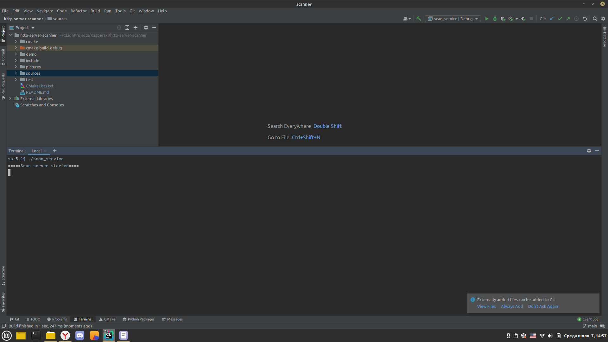
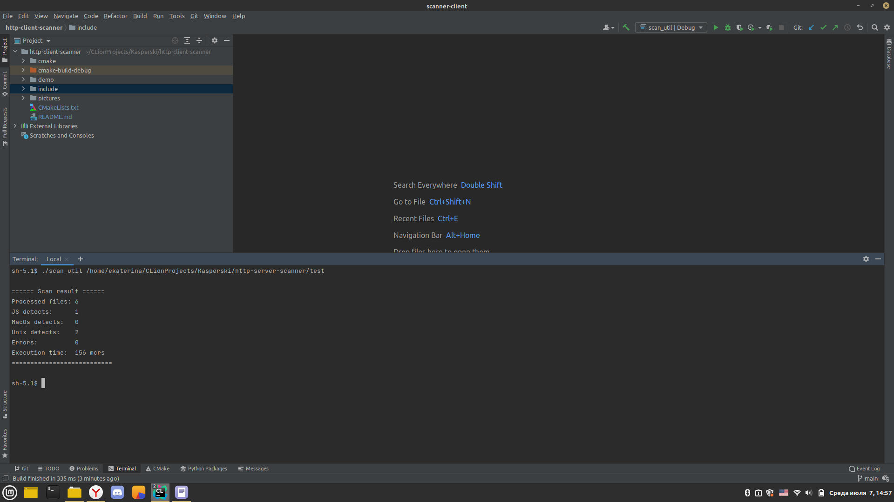

# http-client-scanner

Описание программы:

Утилита клиент-сканер, отправляющая сервисному приложению команду на сканирование файлов в указанной директории. В качестве параметров передается путь к директории. Для реализации задания были использованы несколько библиотек boost, а также std::filesystem.

Based on: https://www.boost.org/doc/libs/1_66_0/libs/beast/doc/html/beast/quick_start.html#beast.quick_start.http_client

Пример работы программы:
1. Запускаем сервер
 
2. Передаем путь к директории для сканирования и получаем ответ от сервера
 

